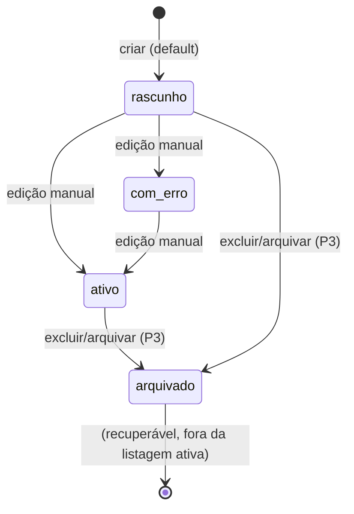

# Data Model: CRUD de Ambientes de Setup (Automatic1)

**Branch**: `001-environment-crud` | **Date**: 2026-09-02 | **Spec**: [spec.md](spec.md) | **Research**: [research.md](research.md)

## Entity: EnvironmentSetup (Setup de Ambiente)

Representa um ambiente/setup catalogado que o Automatic1 pode provisionar. Entidade **única** no v1 (YAGNI). Persistida em SQLite via SQLModel.

| Campo | Tipo (impl.) | Obrigatório | Regras / Validação |
|-------|--------------|-------------|--------------------|
| `id` | inteiro (PK, auto) | — (gerado) | Identificador interno estável |
| `nome` | texto (str) | **Sim** | Único **case/whitespace-insensitive** (FR-002); trim; 1–120 caracteres |
| `descricao` | texto (str) | Não | Texto livre; renderiza "não informado" quando vazio |
| `plataforma_alvo` | texto (str) | **Sim** | Plataforma alvo (ex.: Windows, Linux, macOS); trim; 1–60 caracteres |
| `origem_asset` | texto (str) | **Sim** | Origem/fonte do asset (ex.: URL de repositório ou caminho de script); trim; 1–500 caracteres |
| `versao` | texto (str) | Não | Quando preenchida, **SemVer válida** (`MAJOR.MINOR.PATCH` [+pré-release/+build]) (FR-003) |
| `hash` | texto (str) | Não | Checksum do asset (opcional, p/ rastreabilidade de supply-chain) |
| `licenca` | texto (str) | Não | Licença / notas de compliance do asset |
| `status` | enum texto | Não (default `rascunho`) | Valores: `rascunho` (padrão), `ativo`, `com_erro`, `arquivado` |
| `resultado_ultima_execucao` | texto (str) | Não | Anotação manual opcional (provisionamento fora do escopo) |
| `created_at` / `updated_at` | datetime (auto) | — (gerado) | Timestamps automáticos (FR-011) |
| `created_by` / `updated_by` | texto (str) | Não | Autor, default do operador configurado (`OPERATOR_NAME`, padrão `admin`) (FR-011) |

### Restrições de domínio (negócio)

- **Unicidade do nome**: igualdade após normalização (minúsculas + remoção de espaços duplicados nas bordas). Erro em nível de campo, registro **não** criado, dados preservados (FR-004).
- **Ausência de segredos**: nenhum campo pode conter credenciais; apenas referências/placeholders (FR-013).
- **Auditoria**: toda criação/edição/remoção registra autor + data (FR-011).
- **Persistência durável**: registros sobrevivem a reinícios (FR-012).

### Ciclo de vida do status (transições)

No v1 o status é **definido no cadastro** (default `rascunho`) e editável manualmente. Transições automáticas não existem ainda (dependem de execução real, fora do escopo).

- `arquivado` = exclusão lógica/reversível (FR-010): sai da listagem ativa, permanece recuperável/auditável.

## Relacionamentos

Nenhum no v1 (entidade única). Campos como `origem_asset`/`hash` referenciam ativos externos apenas como **metadados de rastreabilidade** — não há join nem dependência de sistemas externos nesta fase.
