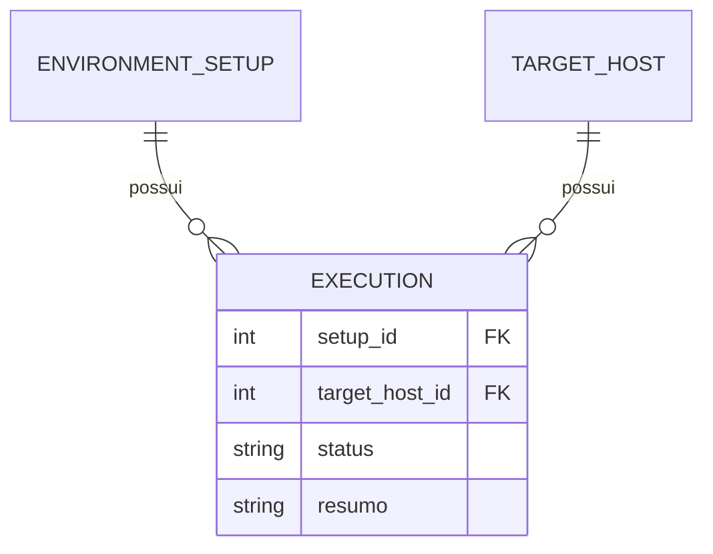

# Data Model: Máquinas Alvo e Execuções (Automatic1)

**Branch**: `003-machines-runs` | **Date**: 2026-09-03 | **Spec**: [spec.md](spec.md) | **Research**: [research.md](research.md)

Evolui o modelo das features `001`/`002` **adicionando** duas entidades. Nenhuma coluna de `environment_setup` muda (regressão zero).

## Entity: TargetHost (Máquina Alvo)

Tabela `target_host`. Host onde o Automatic1 pode provisionar setups (ex.: Debian + Docker Swarm). **Sem credenciais** (FR-004).

| Campo | Tipo (impl.) | Obrigatório | Regras / Validação |
|-------|--------------|-------------|--------------------|
| `id` | inteiro (PK, auto) | — | Identificador interno estável |
| `nome` | texto (str) | **Sim** | Único **case/whitespace-insensitive**; 1–120 |
| `identificacao` | texto (str) | **Sim** | Endereço/identificação do host (ex.: IP ou hostname); 1–255; sem credenciais |
| `plataforma_alvo` | texto (str) | Não (default `"Debian + Docker Swarm"`) | Ambiente-alvo (valor controlado, reuso feature `002`); 1–60 |
| `descricao` | texto (str) | Não | Texto livre; ≤ 1000 |
| `status` | enum texto | Não (default `ativa`) | `ativa` \| `inativa` |
| `created_at`/`updated_at` | datetime | — | Timestamps automáticos (auditoria) |
| `created_by`/`updated_by` | texto | Não | Autor (operador configurado) |

Ciclo de vida: `ativa → inativa` via ação "Desativar" (com confirmação + aviso quando houver execuções); `inativa → ativa` via "Reativar". Exclusão física **não** existe no v1.

## Entity: Execution (Execução)

Tabela `execution`. Registro de execução de um setup em uma máquina (vínculo "utilizações ativas"). **Imutável** no v1 (apenas criação + leitura/histórico).

| Campo | Tipo (impl.) | Obrigatório | Regras / Validação |
|-------|--------------|-------------|--------------------|
| `id` | inteiro (PK, auto) | — | — |
| `setup_id` | inteiro (FK → `environment_setup.id`) | **Sim** | Setup do catálogo executado |
| `target_host_id` | inteiro (FK → `target_host.id`) | **Sim** | Máquina alvo onde ocorreu |
| `status` | enum texto | **Sim** | `planejada` \| `em_andamento` \| `sucesso` \| `erro` \| `cancelada` |
| `resumo` | texto (str) | Não | Log/resumo opcional; ≤ 1000; anti-segredo |
| `created_at` | datetime | — | Timestamp automático |
| `created_by` | texto | Não | Autor (operador configurado) |

### Relacionamentos

### Derivação (Q3=A)

O detalhe do **setup** apresenta a "última execução" lendo a `Execution` mais recente (`created_at` desc) daquele setup. Sem execução → fallback para o campo manual `resultado_ultima_execucao` (feature `001`). Nenhuma escrita no setup é feita pela execução.

## Notas

- Nenhuma alteração em `environment_setup`; tabelas novas via `create_all` (sem migração aditiva nesta feature).
- `environment_setup` NÃO ganha chave estrangeira; consultas por `setup_id`/`target_host_id`.
