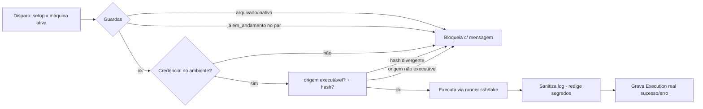

# Data Model: Provisionador Real (Automatic1)

**Branch**: `004-provisioner` | **Date**: 2026-09-03 | **Spec**: [spec.md](spec.md) | **Research**: [research.md](research.md)

## Entity: Execution (feature `003` — evolução aditiva)

A tabela `execution` ganha colunas **nullable** para a execução real (D6). Migração aditiva idempotente via `PRAGMA`+`ALTER` no `init_db` (padrão feature `002`).

| Campo novo | Tipo (impl.) | Obrigatório | Regras |
|------------|--------------|-------------|--------|
| `log` | texto (str) | Não | Saída/erro da execução, **sanitizada** (segredos redigidos — FR-005); registros `003` antigos ficam nulos |
| `exit_code` | inteiro | Não | Código de saída da execução real (nulo p/ registros manuais `003`) |
| `started_at` / `finished_at` | datetime | Não | Horários da execução real (nulos p/ `003` manual) |

- Estados reutilizados da `003`: `planejada`, `em_andamento`, `sucesso`, `erro`, `cancelada`. Execução real síncrona grava `sucesso`/`erro` (com `log`/`exit_code`/horários).
- **Concorrência (FR-007)**: no máximo **uma** `Execution` com `status = em_andamento` por par (`setup_id`, `target_host_id`). Reexecução cria novo registro (histórico preservado).

## Entity: EnvironmentSetup / TargetHost — inalteradas

Servem de **fonte** (`origem_asset`, `versao`, `hash`) e **alvo** (`identificacao`, `status`) da execução. Sem mudança de colunas.

## Fluxo da execução real (engine)

## Notas

- Nenhuma credencial persiste no banco (constituição IV).
- Itens padrão (`002`) com `origem_asset` de repositório **não são executáveis** no v1 (erro acionável) — scripts instaladores virão com a feature instalador.
